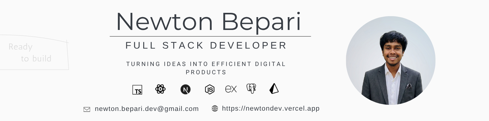

<!-- ========================= Banner ========================= -->

  

<h1 align="center">Hi 👋, I'm Newton</h1>

<h3 align="center">Full Stack Developer</h3>

Building scalable, secure, and modern web applications with TypeScript, Next.js, Node.js, Express, Prisma & PostgreSQL.

📍 Bangladesh &nbsp; | &nbsp;
📧 <a href="mailto:newton.bepari.dev@gmail.com">newton.bepari.dev@gmail.com</a> &nbsp; | &nbsp;
🌐 <a href="https://newtondev.vercel.app" target="_blank">Portfolio</a>

----

## 👨‍💻 About Me

I'm a passionate Full Stack Developer who enjoys building modern, scalable, and user-focused web applications. I love solving real-world problems, learning new technologies, and writing clean, maintainable code.

### 🚀 Current Activities

- 🌱 Exploring advanced features of **Next.js**
- 🔨 Building production-ready full-stack applications
- 🔐 Learning scalable backend architecture with **Prisma & PostgreSQL**
- 💳 Integrating **Stripe** and **SSLCommerz** payment gateways
- 📚 Improving problem-solving and software engineering skills

---

## 🛠️ Skills

### Frontend

### Backend

### Libraries

  
  

### Tools & Platforms

---

## 🌐 Connect With Me

  &nbsp;
  &nbsp;
  &nbsp;
  &nbsp;

## 📊 GitHub Statistics

  
  

  

